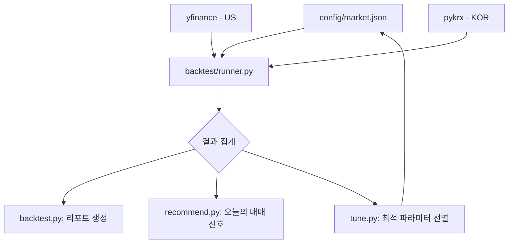

# 시스템 아키텍처 (System Architecture)

## 1. 프로젝트 개요
이 프로젝트는 **나스닥 레버리지 스위칭 전략**을 자동으로 최적화하고 매매 추천을 생성하는 시스템입니다.
핵심 구성요소:
- **튜닝(Tuning)**: 과거 데이터를 기반으로 최적의 파라미터를 탐색
- **백테스트(Backtest)**: 전략의 과거 성과를 검증
- **추천(Recommendation)**: 백테스트 결과를 바탕으로 현재 포지션 결정

## 2. 파일 구조

```
📁 nasdaq-leverage-switching/
├── 📄 tune.py              # 튜닝 실행 진입점 (시장 인자 지원)
├── 📄 backtest.py          # 백테스트 실행 진입점
├── 📄 recommend.py         # 추천 실행 진입점
├── 📁 config/              # 시장별 설정 파일 저장소
│   ├── 📄 us.json          # 미국 시장 설정
│   └── 📄 kor.json          # 한국 시장 설정
├── 📁 logic/
│   ├── 📁 backtest/        # 백테스트 핵심 로직
│   │   ├── runner.py       # 백테스트 엔진
│   │   ├── data.py         # 데이터 다운로드 (yfinance/pykrx)
│   │   ├── signals.py      # 시그널 계산 및 포지션 결정
│   │   └── settings.py     # 설정 로딩 및 포맷 정규화
│   └── 📁 tune/            # 튜닝 로직
│       └── runner.py       # 병렬 튜닝 및 데이터 가용성 체크
├── 📁 utils/
│   ├── 📄 slack.py         # Slack SDK 연동 알림 모듈
│   └── 📄 logger.py        # 전역 로깅 및 버전 관리
├── 📁 .github/workflows/
│   ├── 📄 daily_recommend.yml # 일일 튜닝/추천 자동화
│   └── 📄 deploy.yml       # 코드 업데이트 알림
├── 📁 zresults/            # 실행 결과 저장소
│   ├── 📁 us/              # 미국 시장 로그
│   └── 📁 kor/             # 한국 시장 로그
```

## 3. 모듈 역할

### 진입점 스크립트
| 파일 | 역할 |
|------|------|
| `tune.py` | 파라미터 최적화 실행. 결과를 `config/*.json`에 업데이트 |
| `backtest.py` | 전략 성과 검증. 상세 리포트 및 로그 생성 |
| `recommend.py` | 최근 데이터를 바탕으로 오늘의 포지션 추천 |

### 핵심 로직 (`logic/backtest/`)
| 파일 | 역할 |
|------|------|
| `runner.py` | 백테스트 엔진. **한국 시장(KRW)**과 **미국 시장(USD)** 통화 포맷 자동 전환 |
| `data.py` | `yfinance`(미국) 및 `pykrx`(한국)를 통한 데이터 수집 |
| `signals.py` | QQQ/KODEX나스닥100 기반 드로다운 계산 |
| `settings.py` | 신구형 설정 포맷 호환 및 데이터 정규화 |

### 유틸리티 (`utils/`)
| 파일 | 역할 |
|------|------|
| `slack.py` | `slack-sdk`를 이용한 Block Kit 기반 알림 전송 |
| `logger.py` | `APP_VERSION` 관리 및 실행 로그 기록 |

## 4. 데이터 흐름



1. **설정 로드**: `config/*.json`에서 시장별 파라미터 읽기
2. **데이터 수집**: `yfinance` 또는 `pykrx`를 통해 시그널, 공격, 방어 자산 주가 다운로드
3. **백테스트 실행**: 일별 포지션 및 손익 계산
4. **결과 출력**:
   - `backtest.py`: 전체 기간 리포트 생성
   - `recommend.py`: 최근일 기준 매매 포지션 추천
   - `tune.py`: 모든 조합 비교 후 최적 파라미터를 `config/*.json`에 업데이트
